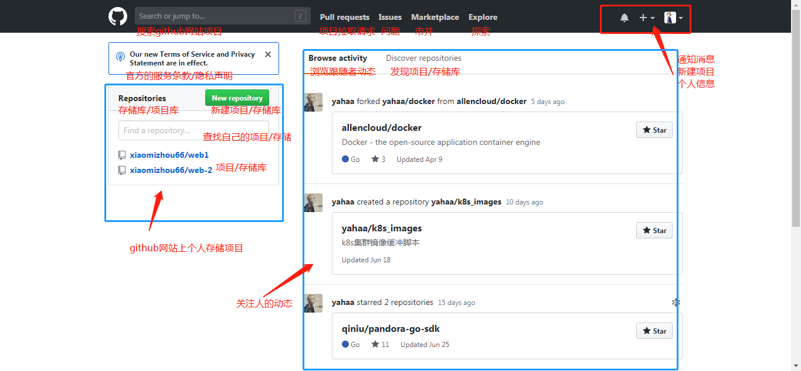
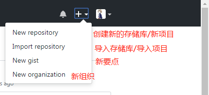
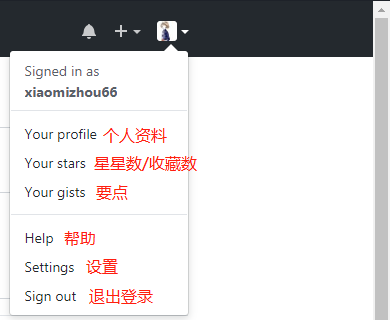
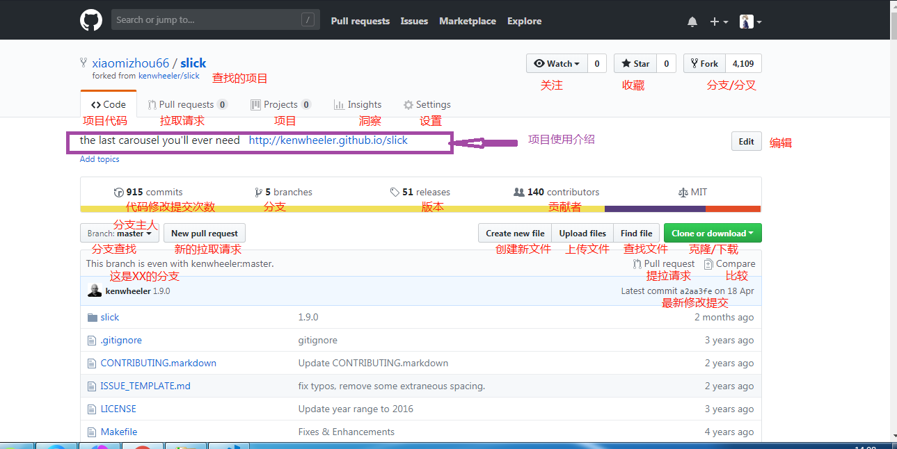
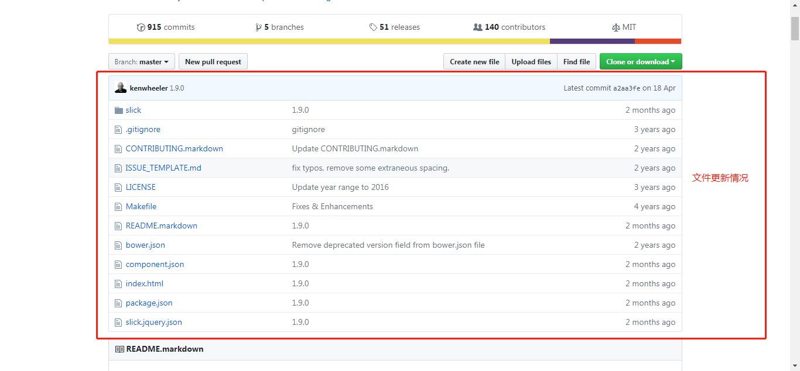
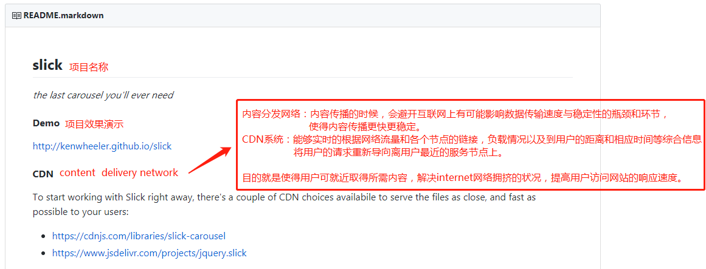
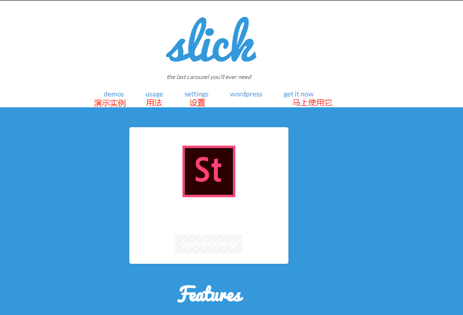

# 下面是github网站的使用方法
## 一、进入github个人主页  
下面是个人主页图片展示 

右上角的拓展 

## 二、进入搜索到的github项目 
 
#### 1、whtch 与 star 以及 fork
&ensp;&ensp;&ensp;&ensp;①Watch，就是一楼说的关注，关注后，代码库中有新的commit你都会收到通知； 
&ensp;&ensp;&ensp;&ensp;②Star，与watch不同，star相当于收藏，你可以方便地找到你star过的库，但是不会收到关于那个库的任何通知。 
&ensp;&ensp;&ensp;&ensp;③fork的意思是从别人的代码库中复制一份到你自己的代码库，与普通的复制不同，fork
包含了原有库中的所有提交记录，fork后这个代码库是完全独立的，属于你自己，你可以在自己的库中做任何修改，当然也可以通过Pull Request向原来的库提交合并请求。
 
 
 
等等，其他的信息 
在使用插件的时候，我们需要查找到适合的可用的，读懂是怎么用的，使用都有什么要求，js文件下载克隆引入，css引入，html结构要求？等等之后再使用。
## 三、进入使用教程 

